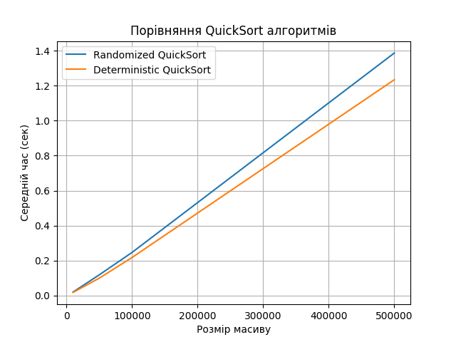
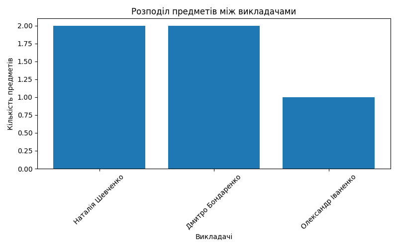
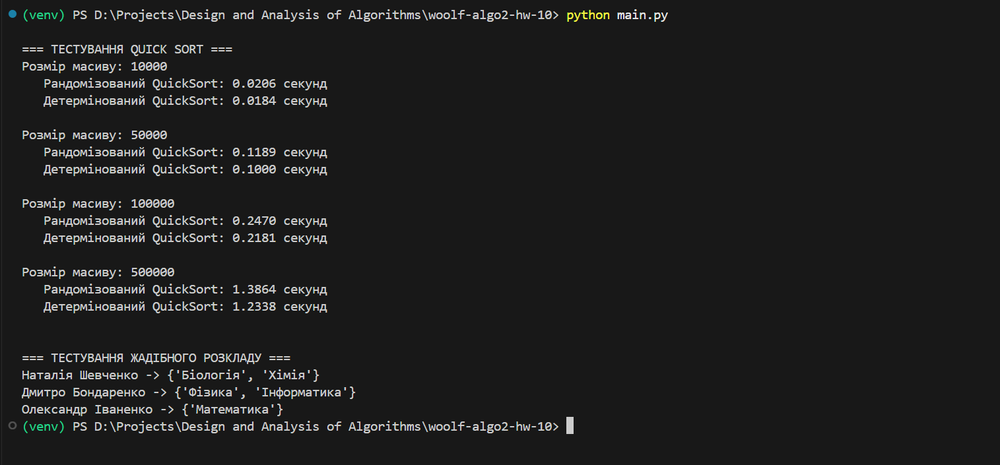

# woolf-algo2-hw-10

# Домашнє завдання 10: Алгоритмічна складність, наближені та рандомізовані алгоритми

## Мета

- Порівняти ефективність рандомізованого та детермінованого QuickSort.
- Реалізувати жадібний алгоритм для складання розкладу занять.

## Репозиторій

[woolf-algo2-hw-10](https://github.com/vikkrat/woolf-algo2-hw-10)

## Структура проєкту

```
woolf-algo2-hw-10/
│
├── task_1_quicksort/
│   ├── quicksort_analysis.py              # реалізації quicksort та аналіз
│   └── __init__.py
│
├── task_2_greedy_schedule/
│   ├── greedy_schedule.py                 # клас Teacher і логіка розкладу
│   └── __init__.py
│
├── screenshots/
│   ├── quicksort_plot.png                 # графік часу виконання
│   └── schedule_output.png                # приклад результату розкладу
│
├── requirements.txt
├── .gitignore
├── README.md
└── main.py                                # запуск обох завдань
```

---

## Завдання 1 — QuickSort

Порівняння часу виконання на масивах 10_000 до 500_000 елементів.

- Скрипт: 

- Результат:


## Завдання 2 — Жадібний алгоритм

Призначення викладачів для покриття всіх предметів.

- Скрипт: 

- Результат:


## Загальний результат



---

## Інструкція з запуску

### Клонування репозиторію
`git clone https://github.com/vikkrat/woolf-algo2-hw-08.git`
`cd woolf-algo2-hw-08`

# Створення та активація віртуального середовища
`python -m venv venv`
`source venv/bin/activate`  # або `venv\Scripts\activate` на Windows

### Встановлення залежностей
`pip install -r requirements.txt`

### Запуск 
`python main.py`

---
